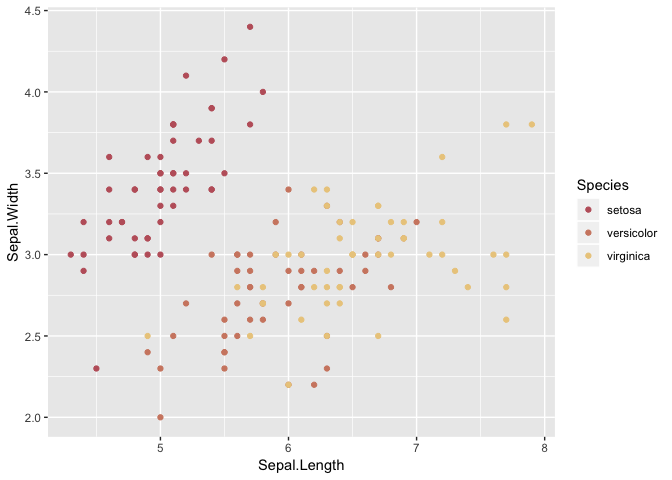

<!-- README.md is generated from README.Rmd. Please edit that file -->
paletteer 
==========================================================

[](https://travis-ci.org/EmilHvitfeldt/paletteer) [](https://codecov.io/github/EmilHvitfeldt/paletteer?branch=master) [](https://ci.appveyor.com/project/EmilHvitfeldt/paletteer) <!---
[](https://cran.r-project.org/package=paletteer)
[](https://CRAN.R-project.org/package=scico)
-->

The goal of paletteer is to be a comprehensize collection of color palettes in R using a common interface. Think of it as the "caret of palettes".

Installation
------------

<!---
You can install the released version of paletteer from [CRAN](https://CRAN.R-project.org) with:

``` r
install.packages("paletteer")
```
-->
the package is not yet on CRAN but ff you want the development version then install directly from GitHub:

``` r
# install.packages("devtools")
devtools::install_github("EmilHvitfeldt/paletteer")
```

Palettes
--------

The palettes are divided into 2 groups; *discrete* and *continuous*. For discrete palette you have the choice between the *fixed width palettes* and *dynamic palettes*. Most common of the two are the fixed width palettes which have a set amount of colors which doesn't change when the number of colors requisted vary like the following palettes:


on the other hand we have the dynamic palettes where the colors of the palette depend on the number of colors you need like the `green.pal` palette from the `cartography` package:


Lastly we have the continuous palettes which provides as many colors as you need for a smooth transition of color:


This package includes 666 from 27 different packages and information about these can be found in the following data.frames: `palettes_c_names`, `palettes_d_names` and `palettes_dynamic_names`.

Examples
--------

All the palettes can be accessed from the 3 functions `paletteer_c()`, `paletteer_d()` and `paletteer_dynamic()` using the package and palette arguments.

``` r
paletteer_c(package = "scico", palette = "berlin", n = 10)
#>  [1] "#9EB0FF" "#5AA3DA" "#2D7597" "#194155" "#11181D" "#270C01" "#501802"
#>  [8] "#8A3F2A" "#C37469" "#FFACAC"
paletteer_d("nord", "frost")
#> [1] "#8FBCBB" "#88C0D0" "#81A1C1" "#5E81AC"
paletteer_dynamic("cartography", "green.pal", 5)
#> [1] "#B8D9A9" "#8DBC80" "#5D9D52" "#287A22" "#17692C"
```

All of the functions also support symbol argument such that you don't have to put your names in quotes

``` r
paletteer_c(scico, berlin, 10)
#>  [1] "#9EB0FF" "#5AA3DA" "#2D7597" "#194155" "#11181D" "#270C01" "#501802"
#>  [8] "#8A3F2A" "#C37469" "#FFACAC"
paletteer_d(nord, frost)
#> [1] "#8FBCBB" "#88C0D0" "#81A1C1" "#5E81AC"
paletteer_dynamic(cartography, green.pal, 5)
#> [1] "#B8D9A9" "#8DBC80" "#5D9D52" "#287A22" "#17692C"
```

ggplot2 scales
--------------

Lastly the package also includes scales for `ggplot2` using the same standard interface

``` r
library(ggplot2)

ggplot(iris, aes(Sepal.Length, Sepal.Width, color = Species)) +
  geom_point() +
  scale_color_paletteer_d(nord, aurora)
```


